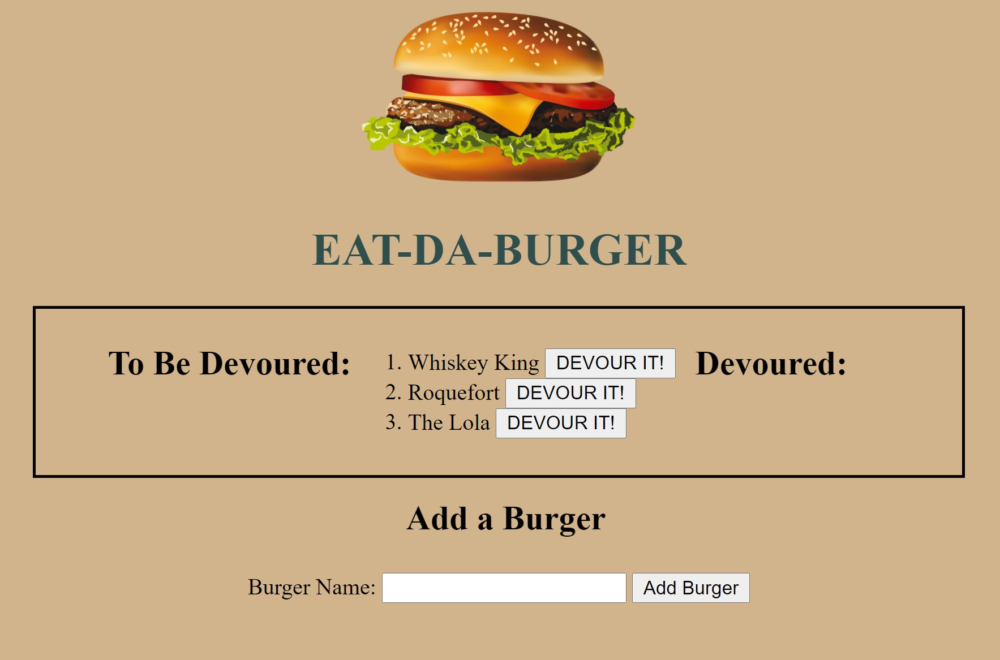

# BurgerLogger

## Description
This app is a fun demonstration of database functionality. The user can add burgers they want to eat, which are then displayed in the "To Be Devoured" list. The user can then click the "Devour It!" button to move the burger to the "Devoured" list. There are no particular installation or usage notes, as the app runs in the browser.

## Questions
Please feel free to contact me with any questions about this project.

Name: Sara McGuinn

GitHub: saramcguinn

Email: sara.mcguinn@gmail.com

